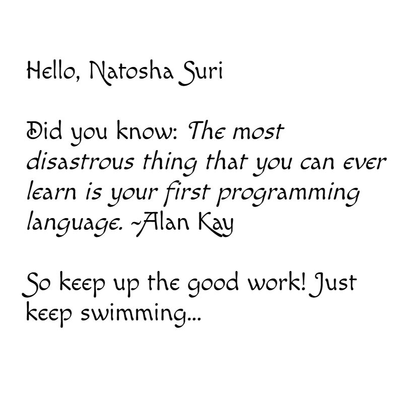

# TypeScript

# Why?
I was guided to do this typescript tutorial by a position I am interviewing for. 

# Installation
> npm install -g typescript

# Usage
Please read the documentation for usage
https://www.npmjs.com/package/typescript/v/1.7.5

# Credit

Followed along this tutorial
https://www.typescriptlang.org/docs/handbook/typescript-in-5-minutes.html

